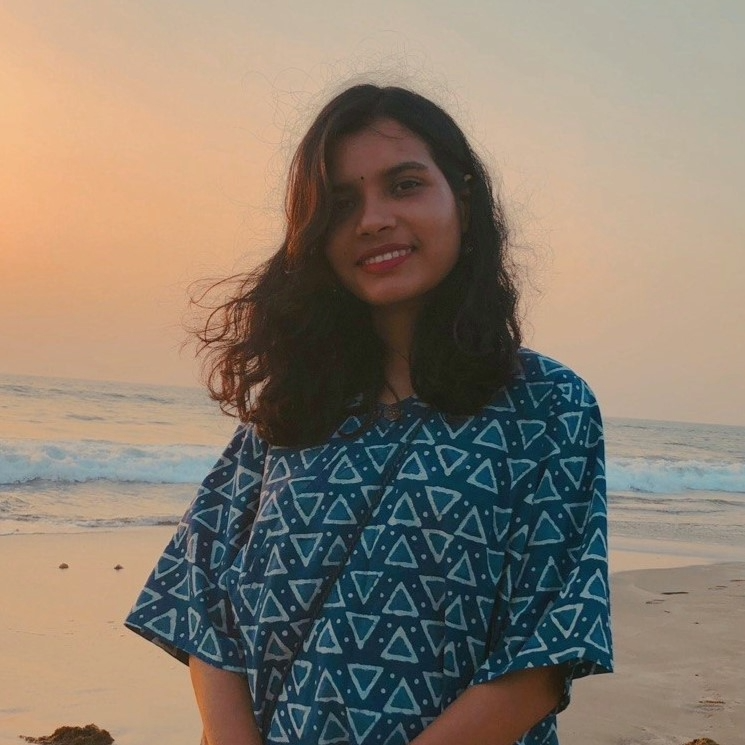
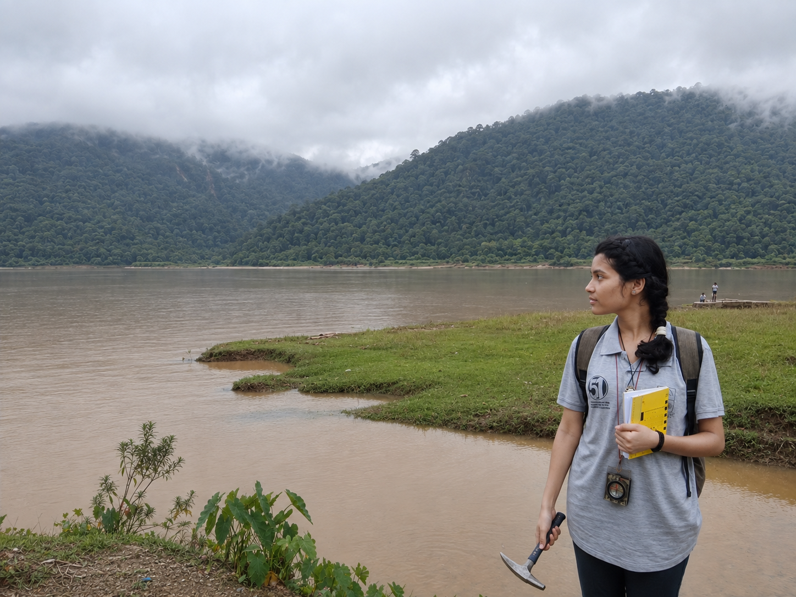
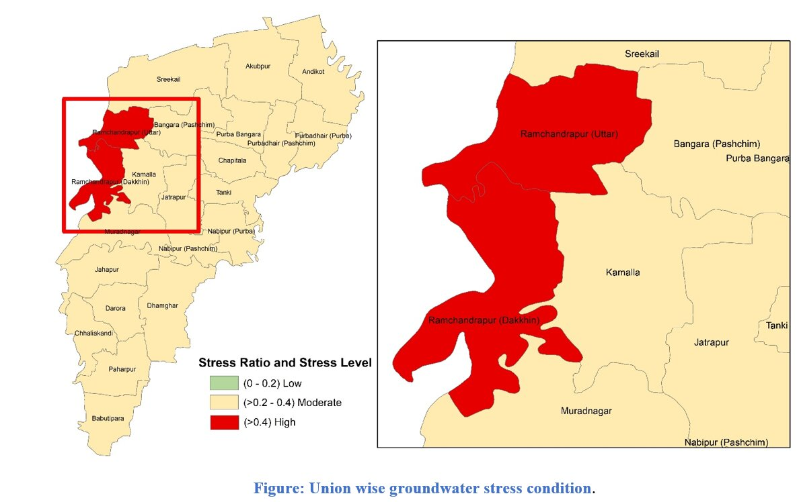

---
hide:
  - toc
  - navigation
---
<!--
CHECKLIST FOR THIS PAGE:
- [ ] Replace [YOUR NAME] with your full name (3 places)
- [ ] Replace [YOUR JOB TITLE] with your current or target role
- [ ] Replace [YOUR TAGLINE] with a short phrase describing your focus
- [ ] Rewrite the About Me paragraph with your own words
- [ ] Replace assets/images/profile.png with your actual photo (keep the filename or update it below)
- [ ] Replace assets/images/about.png with your own image (a field photo, map, or workspace shot)
- [ ] Edit the skill cards to match your actual skills (add, remove, or rename cards as needed)
- [ ] Update GitHub and LinkedIn links in the Connect section
- [ ] Add your CV PDF to docs/assets/ and update the filename in the Download CV button
-->
<!-- Google tag (gtag.js) -->

  
  <h1>Ashwary Banik Dolan</h1>
  
<strong> Geoscientist & Geospatial Researcher </strong>

  
<em>GIS | Remote Sensing | Hydrologic Modeling  | Machine Learning</em>

---

## About Me

I am a geoscientist interested in understanding how Earth and environmental systems respond to climate variability, land-use change, and natural disturbances. My research combines field observations, GIS, remote sensing, process-based modeling, and data-driven methods to investigate interactions among water, landscapes, and the atmosphere. I am particularly interested in interdisciplinary problems involving hydrologic processes, landscape change, environmental hazards, water quality, and climate, with an emphasis on integrating geospatial observations, numerical models, and machine learning and AI approaches to understand environmental change across scales.

  

---

[View My Projects :material-arrow-right:](projects/index.md){ .md-button .md-button--primary }
[Download CV :material-download:](assets/ashwary-CV.pdf){ .md-button }

---
Research Work

My projects explore groundwater sustainability, groundwater flow, water-resource stress, and aquifer geometry through geospatial analysis and hydrogeological modeling.

  <!-- Project 1: Groundwater sustainability -->

  <a class="home-project" href="projects/recharge/"
   aria-labelledby="home-project-recharge">

  

    

  

  
    

      Groundwater Sustainability
      <h3 id="home-project-recharge">GIS-Based Groundwater Budget of the Dhaka Watershed</h3>
      
Assessed how urbanization has changed groundwater recharge across the Dhaka watershed by combining satellite-based land-use classification with WetSpass-M water-balance modeling.

      
The project connects land-use change with spatial patterns of recharge, runoff, and groundwater sustainability.

      

        Google Earth Engine
        ArcGIS Pro
        WetSpass-M
      

      View project &rarr;
    

  </a>

  <!-- Project 2: Groundwater flow modeling -->

<a class="home-project" href="projects/dwasa/"
   aria-labelledby="home-project-dwasa">

  

    

  

  
    

      Numerical Groundwater Modeling
      <h3 id="home-project-dwasa">3D Groundwater Flow Modeling of the Dhaka Watershed</h3>
      
Contributed to a regional MODFLOW 6 model to investigate long-term groundwater depletion in Dhaka and surrounding areas.

      
The model represents a layered aquifer system, groundwater abstraction, recharge, and river–aquifer interaction, with calibration against observed groundwater levels.

      

        MODFLOW 6
        ModelMuse
        ArcGIS Pro
        Python
      

      View project &rarr;
    

  </a>

  <!-- Project 3: Groundwater stress -->

 <a class="home-project" href="projects/gw_stress/"
   aria-labelledby="home-project-stress">

  

    

  

  
    

      Water-Resource Assessment
      <h3 id="home-project-stress">Groundwater Stress and Vulnerability Assessment</h3>
      
Assessed groundwater stress in Muradnagar Upazila by comparing domestic and irrigation demand with renewable groundwater availability.

      
Integrated recharge, return flow, and environmental-flow requirements in GIS to identify areas facing greater pressure on groundwater resources.

      

        Google Earth Engine
        ArcGIS Pro
        WetSpass
      

      View project &rarr;
    

  </a>

  <!-- Project 4: Aquifer geometry -->

<a class="home-project" href="projects/aquifer/"
   aria-labelledby="home-project-aquifer">

  

    
  

  
    

      Subsurface Characterization
      <h3 id="home-project-aquifer">Aquifer Geometry Analysis Using RockWorks</h3>
      
Analyzed primary and secondary borehole lithology records to interpret the subsurface distribution and thickness of aquifers.

      
Developed lithological striplogs and regional cross sections in RockWorks to identify probable aquifer units and understand their geometry.

      

        RockWorks
        Borehole Analysis
        Lithological Cross Sections
      

      View project &rarr;
    

  </a>

---

## Skills

-   :material-layers:{ .lg .middle } **GIS & Remote Sensing**

    ---

    - QGIS, ArcGIS Pro, Google Earth Engine
    - ENVI, ERDAS IMAGINE, SNAP
    - GDAL, Rasterio, Xarray 
    - Data formats: GeoJSON, GeoTIFF, NetCDF
    - Multispectral & Sentinel time series analysis
    - LULC classification (103-class, plot-level)
    - FLUS , PLUS model — future LULC prediction

-   :material-water:{ .lg .middle } **Hydrologic & Climate Modeling**

    ---

    - MODFLOW 6, Model Muse, WetSpass, SWAT, RockWorks, HEC-HMS
    - Hydrochemical & Water quality analysis
    - WRF, CMIP6, ECMWF
    - Ensemble & Downscaling

-   :material-terrain:{ .lg .middle } **Geophysical & Geotechnical**

    ---

    - VES, ERT surveys
    - SPT analysis, Soil profiling, Bearing capacity assessment
    - GeoStudio
    - Stratigraphic logging, Structural mapping

-   :material-code-braces:{ .lg .middle } **Programming**

    ---

    - Python — GeoPandas, NumPy, Pandas, Matplotlib ,Seaborn
    - R — sf, terra, ggplot2
    - JavaScript

-   :material-star-four-points:{ .lg .middle } **Machine Learning & GeoAI**

    ---

    - Supervised classification 
    - scikit-learn, PyTorch, TensorFlow
    - Object detection in satellite imagery

-   :material-palette:{ .lg .middle } **Visualization & Cartography**

    ---

    - Power BI, Mapbox
    - Adobe Illustrator, Photoshop, Lightroom

---

## Connect

[GitHub](https://github.com/AshwaryBanik){ .md-button }
[LinkedIn](https://linkedin.com/in/ashwarybanik/){ .md-button }
