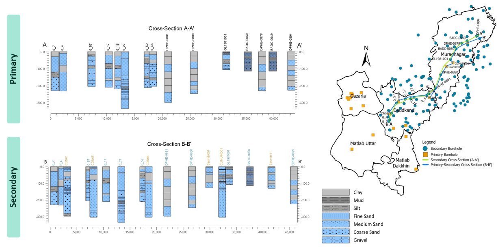
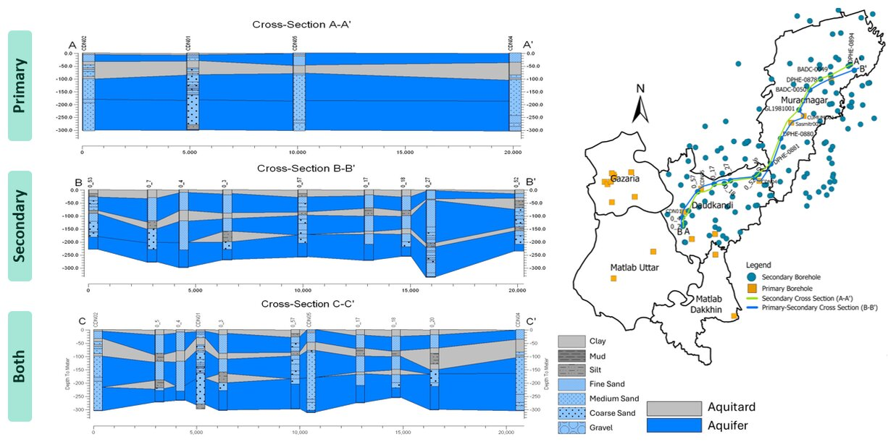

# Aquifer Geometry Analysis Using RockWorks

  

    
  

  

    
  

  
  

## Overview

Analyzed borehole lithology data using **RockWorks** to define aquifer geometry and identify probable aquifer units. The work focused on organizing borehole records, generating lithological striplogs and cross sections, and interpreting the subsurface distribution of aquifers.

---

## Methods & Tools

### Required Data

- Primary borehole data from the GoB-UNICEF Monitoring Well network
- Secondary borehole data from DPHE, and BWDB
- Borehole lithological information including depth and sediment type

### Processing Steps

1. **Borehole Data Preparation**  
    Collected and organized primary and secondary borehole data for lithological analysis.

2. **RockWorks Database Preparation**  
    Imported and organized borehole lithology data in **RockWorks**.

3. **Lithological Striplogs**  
    Generated borehole striplogs to visualize vertical changes in subsurface lithology.

4. **Lithological Cross Sections**  
    Created regional cross sections from borehole data to visualize lateral and vertical variations in subsurface geology.

5. **Aquifer Identification**  
    Interpreted the lithological cross sections to identify probable aquifer units and their spatial distribution.

6. **Aquifer Thickness Analysis**  
    Used the interpreted aquifer boundaries to assess aquifer thickness and support isopach mapping.

### Tools Used

| Tool | Purpose |
|---|---|
| **RockWorks** | Borehole-data management, striplog generation, lithological cross sections, aquifer interpretation |

---
