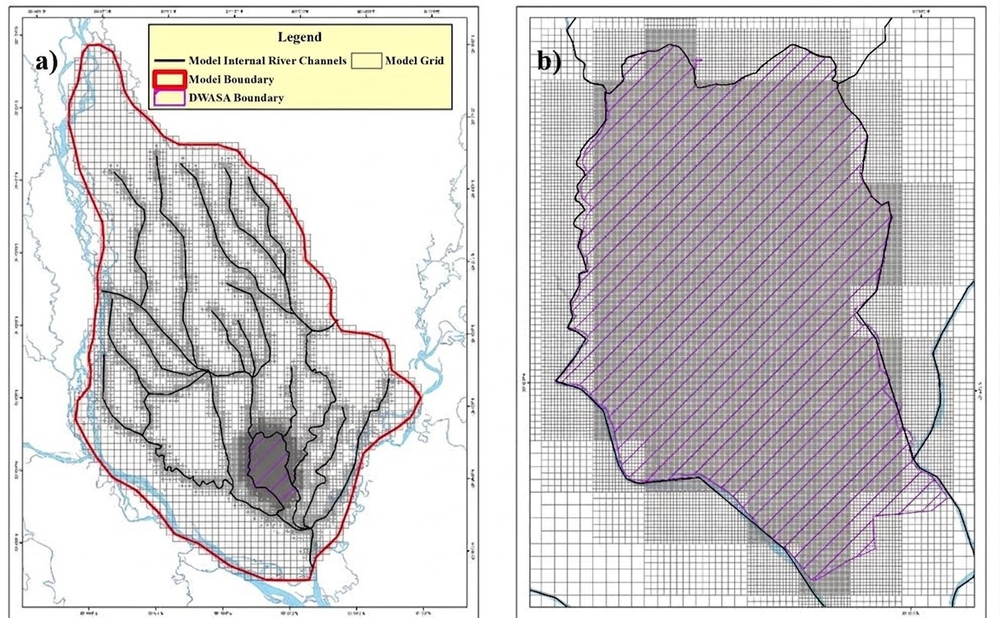
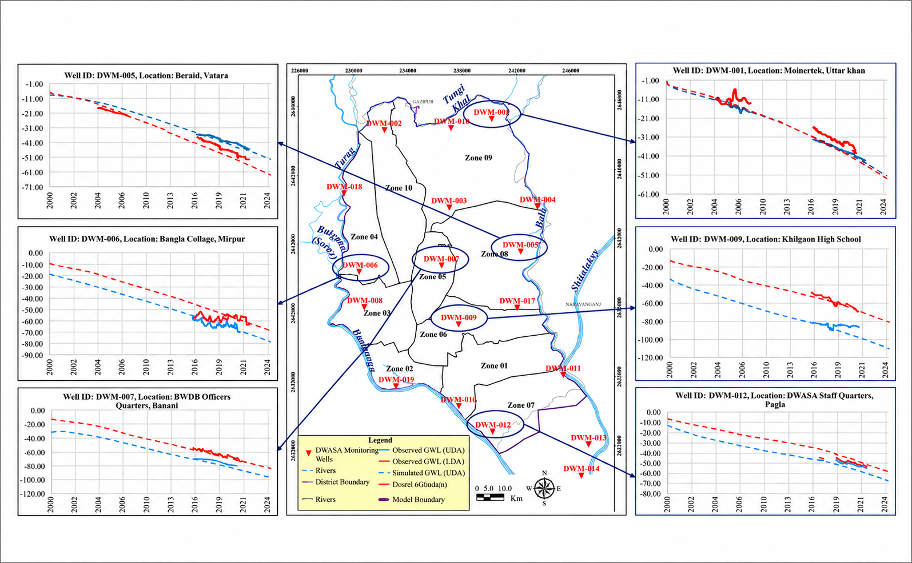

# 3D Groundwater Flow Modeling of the Dhaka Watershed

  

    
  

  

    
  

  
  

## Overview

Developed a regional 3D groundwater flow model to investigate long-term groundwater depletion in Dhaka and the surrounding areas. The model was designed to represent the complex multi-layer aquifer system, groundwater abstraction, recharge, river–aquifer interaction, and the expansion of the groundwater cone of depression.

The groundwater system was simulated using MODFLOW 6 with a locally refined numerical grid and calibrated using observed groundwater-level data.

**Study Area:** North Central Hydrogeological Region of Bangladesh, with a focus on Dhaka and surrounding areas  
**Role:** Groundwater Modeling Contributor  
**Supervisor:** Dr. Md. Mahfuzur R. Khan, Associate Professor, Department of Geology,DU

---

## Methods & Tools

### Data Sources

- Borehole and lithology data
- Groundwater-level data
- Pump-test and hydraulic conductivity data
- Groundwater abstraction data
- Surface-water level and river data
- Groundwater recharge data
- Topography, land-use, soil, and hydrometeorological data

### Processing Steps

1. **Aquifer Setup**  
   Built the aquifer framework using borehole logs and represented the Upper Dupi Tila Aquifer (UDA), Lower Dupi Tila Aquifer (LDA), and the aquitard between them.

2. **MODFLOW 6 Model**  
   Developed a 3D groundwater flow model in MODFLOW 6.

3. **Boundary Conditions**  
   Used major rivers as model boundaries and included river–groundwater interaction, recharge, and drainage.

4. **Model Grid**  
   Created a refined grid covering about **15,188 km²**. Grid size was refined to about **78 × 78 m** inside the DWASA area. The model contained **72,715 active cells**.

5. **Model Layers**  
   Represented the UDA, LDA, and the intermediate aquitard. The LDA was divided into multiple layers to better represent vertical groundwater flow.

6. **Time Setup**  
   Used annual stress periods to simulate long-term groundwater-level changes.

7. **Model Parameters**  
   Assigned hydraulic conductivity, anisotropy, specific yield, and specific storage using available field and pump-test data.

### Tools Used

| Tool | Purpose |
|------|---------|
| **MODFLOW 6** | 3D numerical simulation of groundwater flow |
| **ModelMuse** | Model construction, grid generation, parameter assignment, and boundary-condition setup |
| **WetSpass** | Spatial estimation of groundwater recharge |
| **Arcgis Pro** | Preparation and analysis of spatial hydrogeological datasets |
| **Python** | Standardization, organization, and processing of large borehole-log and groundwater-level datasets |

---

## Key Findings

- The model reproduced the long-term groundwater decline and the development of the groundwater cone of depression around Dhaka.

---