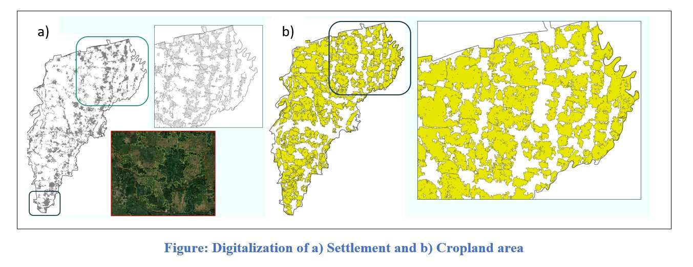
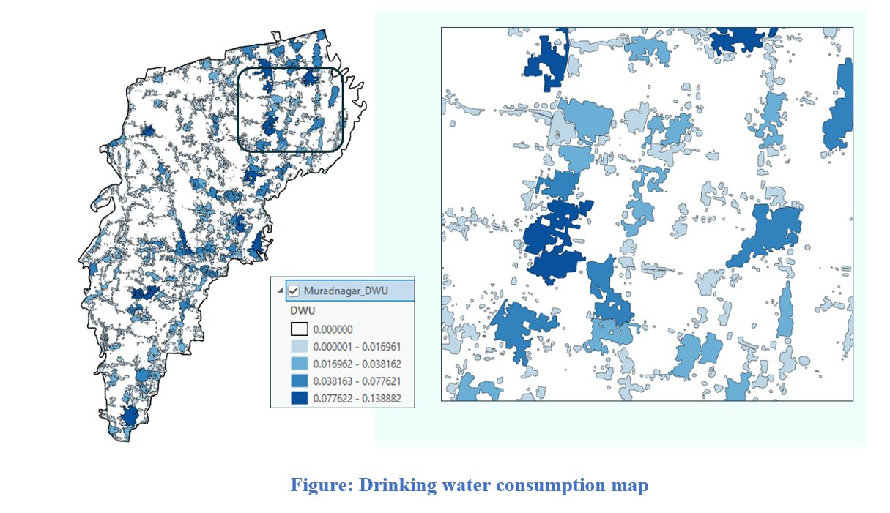
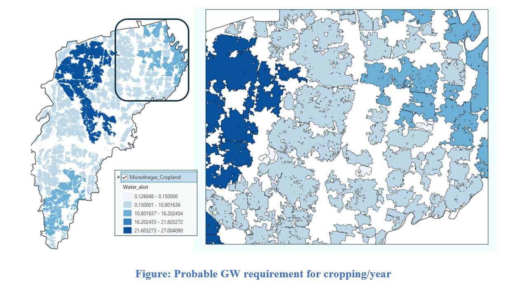
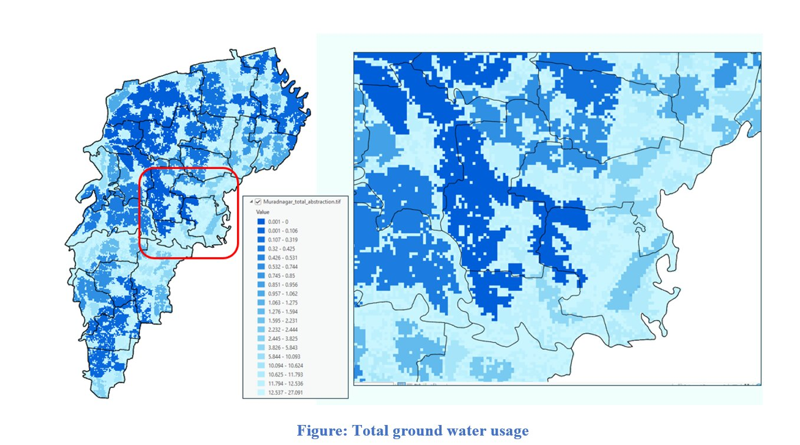
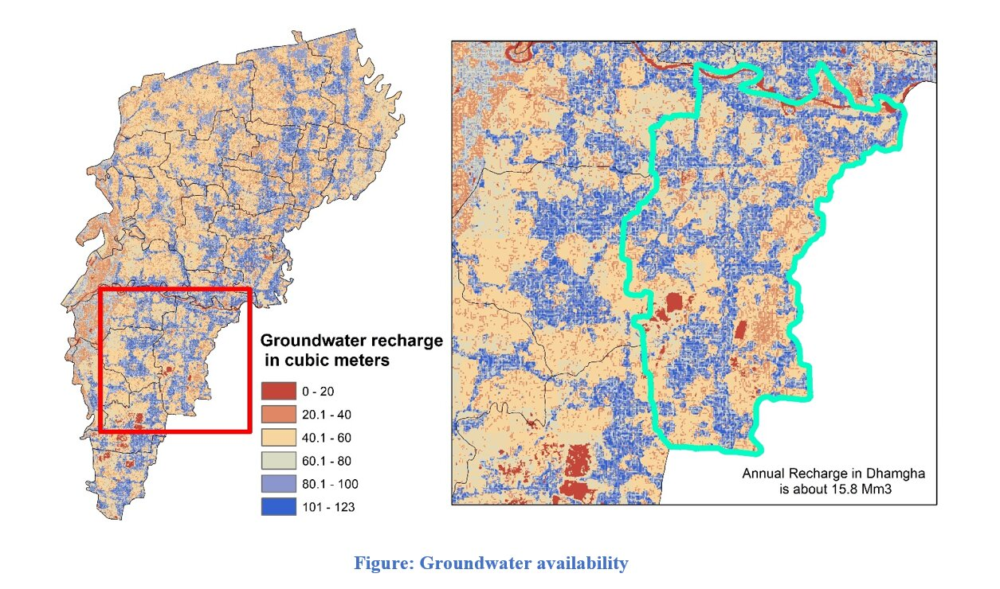

# Groundwater Stress and Vulnerability Assessment of Muradnagar Upazila

## Overview

Assessed groundwater stress and vulnerability in Muradnagar Upazila by comparing groundwater demand with renewable groundwater availability. Domestic and irrigation water demand, groundwater recharge, return flow, and environmental-flow requirements were integrated in GIS to identify areas experiencing greater pressure on groundwater resources.

**Study Area:** Muradnagar Upazila, Cumilla, Bangladesh  
**Supervisor:** Dr. Md. Mahfuzur R. Khan, Associate Professor, Department of Geology,DU 
**Status:** Completed

---

## Methods & Tools

### Required Data

- Union-wise population data
- Settlement area
- Cropland area
- Groundwater recharge
- Administrative boundaries

### Processing Steps

1. **Settlement & Cropland Mapping**  
    Prepared settlement and cropland maps from land-cover data.

    

    

2. **Domestic Water Demand**  
    Estimated drinking-water demand using population distribution and an assumed consumption rate of **50 L/person/day**.

    

    

3. **Irrigation Water Demand**  
    Estimated groundwater requirement for irrigation from mapped cropland area.

    

    

4. **Total Groundwater Use**  
    Combined domestic and irrigation demand to prepare the total groundwater-use map.

    

    

5. **Groundwater Availability**  
    Used spatial groundwater recharge estimated from the **WetSpass model** to represent renewable groundwater availability.

    

    

6. **Groundwater Stress Assessment**  

    A **40% return flow** from abstracted groundwater and **40% of potential recharge for environmental flow** were considered in the assessment.

7. **Stress Classification & Mapping**  
    Classified the resulting groundwater-stress ratio using the renewable water-stress scale:

    

    

    

### Tools Used

| Tool | Purpose |
|---|---|
| **Arcgis Pro** | Spatial-data processing, overlay analysis, calculation, and groundwater-stress mapping |
| **WetSpass** | Groundwater recharge estimation used as an input for groundwater availability |
| **Google Earth Engine** | LULC mapping and classification |

---

## Key Findings

Groundwater stress was **moderate in most unions**, while **Ramchandrapur (Dakkhin)** and **Ramchandrapur (Uttar)** were classified as **high-stress areas**, with stress ratios of **0.434** and **0.414**, respectively.

---

## Reference

Gleeson, T., Wada, Y., Bierkens, M. F. P., & van Beek, L. P. H. (2012). Water balance of global aquifers revealed by groundwater footprint. *Nature, 488*, 197–200.

