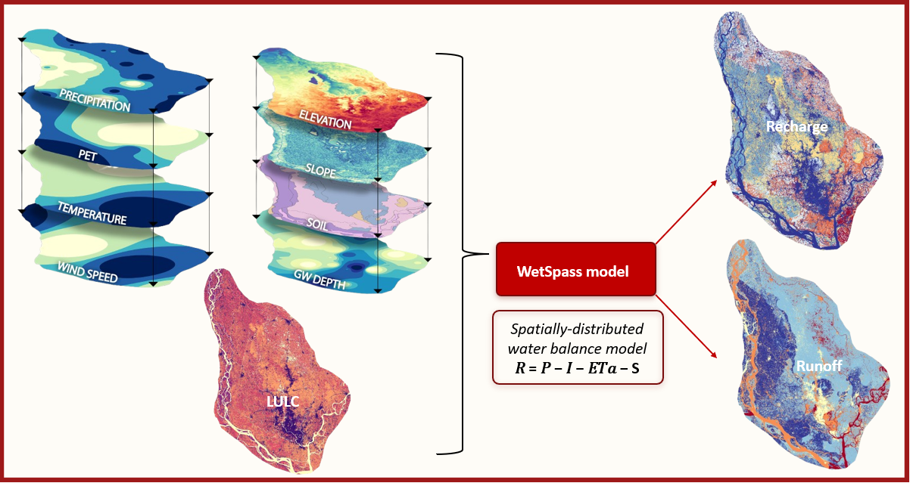

---
hide:
  - toc
  - navigation
---
<!--
CHECKLIST FOR THIS PAGE:
- [ ] Replace the two placeholder cards (marked [YOUR PROJECT ...]) with your real projects
- [ ] For each project: add a thumbnail image to docs/assets/images/ and update the path below
- [ ] For each project: create a project page by copying sample-project.md
- [ ] For each project: add a nav entry in mkdocs.yml (see the comments there)
- [ ] Delete placeholder cards you don't need yet

# Projects

A selection of my geospatial projects. Click any card to see the full write-up.

**[Sample Project](sample-project.md)**

[YOUR PROJECT DESCRIPTION — one or two sentences: what you did, what data you used,
and what you found or built.]

`[TOOL 1]` `[TOOL 2]` `[TOOL 3]`

[View Project →](sample-project.md){ .md-button }

**[Sample Notebook](sample-notebook.ipynb)**

[YOUR PROJECT DESCRIPTION — one or two sentences: what you did, what data you used,
and what you found or built.]

`Python` `pandas` `Folium`

[View Project →](sample-notebook.ipynb){ .md-button }

-->

# Projects

**[Evaluation of Groundwater Sustainability in watershed of Dhaka by Constructing GIS Based Groundwater Budget](recharge.md)**

This project assessed how rapid urbanization has affected groundwater recharge across the Dhaka watershed by combining machine learning based LULC classification with the physically based WetSpass-M hydrological model, quantifying a decade scale shift in the city's groundwater budget.

`GEE` `Arcgis Pro` `WetSpass`

[View Project →](recharge.md){ .md-button }

**[3D Groundwater Flow Modeling of the Dhaka Watershed](dwasa.md)**

Developed a regional 3D groundwater flow model to investigate long-term groundwater depletion in Dhaka and the surrounding areas. The model was designed to represent the complex multi-layer aquifer system, groundwater abstraction, recharge, river–aquifer interaction, and the expansion of the groundwater cone of depression.

`MODFLOW 6` `Arcgis Pro` `Python`

[View Project →](dwasa.md){ .md-button }

**[Groundwater Stress and Vulnerability Assessment](gw_stress.md)**

Assessed groundwater stress and vulnerability in Muradnagar Upazila by comparing groundwater demand with renewable groundwater availability. Domestic and irrigation water demand, groundwater recharge, return flow, and environmental-flow requirements were integrated in GIS to identify areas experiencing greater pressure on groundwater resources.

`GEE` `Arcgis Pro` `WetSpass`

[View Project →](gw_stress.md){ .md-button }

**[Aquifer Geometry Analysis Using RockWorks](aquifer.md)**

Analyzed primary and secondary borehole lithology data in RockWorks to develop striplogs and lithological cross sections, identify probable aquifer units, and interpret aquifer geometry and thickness.

`RockWorks` 

[View Project →](aquifer.md){ .md-button }

