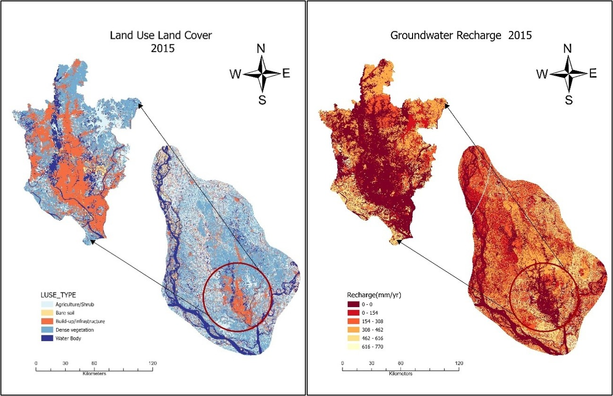
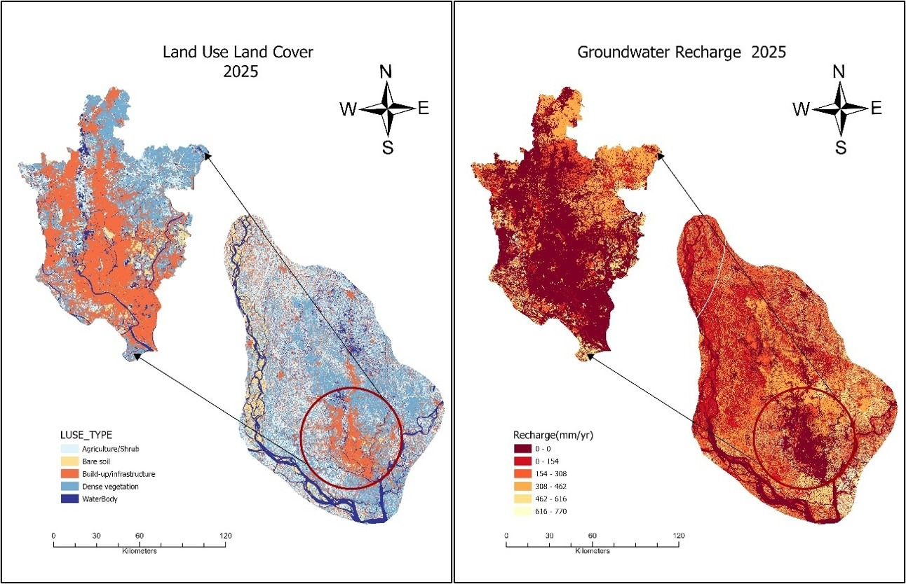

# Evaluation of Groundwater Sustainability in watershed of Dhaka by Constructing GIS Based Groundwater Budget


<div class="project-slider">

  <div class="project-slide">
    
  </div>

  <div class="project-slide">
    
  </div>
</div>

<div class="project-dots">
  <span class="project-dot" onclick="currentProjectSlide(1)"></span>
  <span class="project-dot" onclick="currentProjectSlide(2)"></span>
</div>

<style>
.project-slider {
  position: relative;
  width: 100%;
  max-width: 850px;
  margin: 20px auto 8px;
  overflow: hidden;
  border-radius: 10px;
}

.project-slide {
  display: none;
  width: 100%;
}

.project-slide img {
  display: block;
  width: 100%;
  height: auto;
  border-radius: 10px;
}

.project-dots {
  text-align: center;
  margin-top: 8px;
  margin-bottom: 20px;
}

.project-dot {
  display: inline-block;
  width: 10px;
  height: 10px;
  margin: 0 4px;
  background: #bbb;
  border-radius: 50%;
  cursor: pointer;
}

.project-dot.active {
  background: #555;
}
</style>

<script>
let projectSlideIndex = 0;

function showProjectSlide(n) {
  const slides = document.getElementsByClassName("project-slide");
  const dots = document.getElementsByClassName("project-dot");

  for (let i = 0; i < slides.length; i++) {
    slides[i].style.display = "none";
  }

  for (let i = 0; i < dots.length; i++) {
    dots[i].classList.remove("active");
  }

  slides[n].style.display = "block";
  dots[n].classList.add("active");
}

function nextProjectSlide() {
  const slides = document.getElementsByClassName("project-slide");
  projectSlideIndex++;
  if (projectSlideIndex >= slides.length) {
    projectSlideIndex = 0;
  }
  showProjectSlide(projectSlideIndex);
}

function currentProjectSlide(n) {
  projectSlideIndex = n - 1;
  showProjectSlide(projectSlideIndex);
}

showProjectSlide(projectSlideIndex);
setInterval(nextProjectSlide, 2000);
</script>

## Overview

This project assessed how rapid urbanization has affected groundwater recharge across the Dhaka watershed by combining machine learning based LULC classification with the physically based WetSpass-M hydrological model, quantifying a decade scale shift in the city's groundwater budget.

**Study Area:** Dhaka watershed, Bangladesh  
**Duration:** January 2024 – December 2024  
**Status:** Completed 

---

## Methods & Tools

**Data Sources**

- Landsat 8/9 satellite imagery (2015 & 2025)
- SRTM 30 m Digital Elevation Model — USGS Earth Explorer
- Soil texture and hydrologic soil maps — Geological Survey of Bangladesh
- Hydroclimate Data — Bangladesh Meteorological Department
- Groundwater level data from 168 observation wells — Bangladesh Water Development Board 

**Processing Steps**

1. Classified LULC (5 classes) for 2015 and 2025 using Random Forest in Google Earth Engine.
2. Derived DEM, slope and soil texture layers in ArcGIS Pro.
3. Interpolated climate and groundwater-level data (IDW) into monthly raster inputs.
4. Ran WetSpass-M to compute recharge, runoff; validated classification accuracy and compared recharge patterns.

**Tools Used**

| Tool | Purpose |
|------|---------|
| Google Earth Engine | Satellite image preprocessing and Random Forest LULC classification] |
| ArcGIS Pro | 	DEM, slope processing, soil digitization, spatial data preparation |
| WetSpass-M | Physically based, GIS-integrated water balance modeling |


## Source Code

```javascript

// 1. Define ROI

var roi = ee.FeatureCollection(
  'projects/ee-ashwarybanik-2018/assets/BD_NC_Dhaka_focus_model_domain'
);
Map.centerObject(roi, 11);
 
// 2. Scale SR bands & thermal band

function applyScaleFactors(image) {
  // optical SR bands (all SR_B* bands)
  var optical = image.select('SR_B.').multiply(0.0000275).add(-0.2);
  // thermal band for Landsat 8/9 Level-2
  var thermal = image.select('ST_B10')
                     .multiply(0.00341802)
                     .add(149.0)
                     .rename('ST_B10');
  return image.addBands(optical, null, true)
              .addBands(thermal, null, true);
}
 
// 3. Cloud + shadow mask

function maskClouds(image) {
  var qa = image.select('QA_PIXEL');
  var mask = qa.bitwiseAnd(1 << 3).eq(0)    // bit 3: no cloud
           .and(qa.bitwiseAnd(1 << 4).eq(0)); // bit 4: no cloud shadow
  return image.updateMask(mask);
}
 
// 4. Load Landsat 8 + Landsat 9 Collection 2 L2 (2025) and merge

var l8 = ee.ImageCollection('LANDSAT/LC08/C02/T1_L2')
  .filterBounds(roi)
  .filterDate('2025-01-01', '2025-12-31')
  .filter(ee.Filter.lt('CLOUD_COVER', 10))
  .map(applyScaleFactors)
  .map(maskClouds);
 
var l9 = ee.ImageCollection('LANDSAT/LC09/C02/T1_L2')
  .filterBounds(roi)
  .filterDate('2025-01-01', '2025-12-31')
  .filter(ee.Filter.lt('CLOUD_COVER', 10))
  .map(applyScaleFactors)
  .map(maskClouds);
 
var landsat2025 = l8.merge(l9);
 
// 5. Build composite
var image2 = landsat2025.median().clip(roi);
 
// 6. Indices

var base = image2.select([
  'SR_B2','SR_B3','SR_B4','SR_B5','SR_B6',
  'ST_B10','SR_B7'
]);
 
// NDVI = (NIR - Red) / (NIR + Red)
var ndvi  = base.normalizedDifference(['SR_B5','SR_B4']).rename('NDVI');
 
// MNDWI = (Green - SWIR1) / (Green + SWIR1)
var mndwi = base.normalizedDifference(['SR_B3','SR_B6']).rename('MNDWI');
 
// NDBI = (SWIR1 - NIR) / (SWIR1 + NIR)
var ndbi  = base.normalizedDifference(['SR_B6','SR_B5']).rename('NDBI');
 
var composite = base.addBands([ndvi, mndwi, ndbi]);
 
// 7. DRY layer definitions

var layerConfigs = [
  { name: 'False Color (SWIR1/NIR/Red)', bands: ['SR_B6','SR_B5','SR_B4'] },
  { name: 'Color Infrared',              bands: ['SR_B5','SR_B4','SR_B3'] },
  { name: 'True Color',                  bands: ['SR_B4','SR_B3','SR_B2'] },
  { name: 'NDVI',                        bands: ['NDVI'],  palette: ['blue','yellow','green','red'] },
  { name: 'MNDWI',                       bands: ['MNDWI'], palette: ['red','white','blue'] },
  { name: 'NDBI',                        bands: ['NDBI'],  palette: ['yellow','green','red'] }
];
 
// 8. Loop, reduceRegion, evaluate, then Map.addLayer

layerConfigs.forEach(function(cfg) {
  var stats = composite.select(cfg.bands)
    .reduceRegion({
      reducer: ee.Reducer.minMax(),
      geometry: roi,
      scale: 30,
      bestEffort: true
    });
 
  stats.evaluate(function(statDict) {
    var mins = [], maxs = [];
    cfg.bands.forEach(function(b) {
      mins.push(statDict[b + '_min']);
      maxs.push(statDict[b + '_max']);
    });
 
    var vis = {
      bands: cfg.bands,
      min: mins,
      max: maxs
    };
    if (cfg.palette) vis.palette = cfg.palette;
 
    Map.addLayer(composite, vis, cfg.name);
  });
});
 
// 9. Merge ground control points

var gcps = Build_up.merge(Bare_Soil).merge(Agriculture).merge(Dense_vegetation).merge(River);
print(gcps);
 
//***********************************
 
function normalize(image){
  var bandNames = image.bandNames();
  var minDict = image.reduceRegion({
    reducer: ee.Reducer.min(),
    geometry: roi,
    scale: 10,
    maxPixels: 1e9,
    bestEffort: true,
    tileScale: 16
  });
  var maxDict = image.reduceRegion({
    reducer: ee.Reducer.max(),
    geometry: roi,
    scale: 10,
    maxPixels: 1e9,
    bestEffort: true,
    tileScale: 16
  });
  var mins = ee.Image.constant(minDict.values(bandNames));
  var maxs = ee.Image.constant(maxDict.values(bandNames));
 
  var normalized = image.subtract(mins).divide(maxs.subtract(mins));
  return normalized;
}
 
var composite = normalize(composite);
 
// Split GCPs into training (70%) and validation (30%) sets

var gcp = gcps.randomColumn();
var trainingGcp = gcp.filter(ee.Filter.lt('random', 0.70));
var validationGcp = gcp.filter(ee.Filter.gte('random', 0.70));
 
var training = composite.sampleRegions({
  collection: trainingGcp,
  properties: ['Class'],
  scale: 30
});
 
// Train a Random Forest classifier

var classifier = ee.Classifier.smileRandomForest(50).train({
  features: training,
  classProperty: 'Class',
  inputProperties: composite.bandNames()
});
 
print(classifier.explain());
 
// Variable importance

var importance = ee.Dictionary(classifier.explain().get('importance'));
var sum = importance.values().reduce(ee.Reducer.sum());
var relativeImportance = importance.map(function(key, val) {
  return (ee.Number(val).multiply(100)).divide(sum);
});
print(relativeImportance);
 
var importanceFc = ee.FeatureCollection([
  ee.Feature(null, relativeImportance)
]);
 
var chart = ui.Chart.feature.byProperty({
  features: importanceFc
}).setOptions({
  title: 'Feature Importance',
  vAxis: {title: 'Importance'},
  hAxis: {title: 'Feature'}
});
print(chart);
 
// Hyperparameter Tuning
//**************************************************************************
 
var test = composite.sampleRegions({
  collection: validationGcp,
  properties: ['Class'],
  scale: 10,
  tileScale: 16
});
 
// Tune numberOfTrees

var numTreesList = ee.List.sequence(10, 150, 10);
 
var accuracies = numTreesList.map(function(numTrees) {
  var classifier = ee.Classifier.smileRandomForest(numTrees)
      .train({
        features: training,
        classProperty: 'Class',
        inputProperties: composite.bandNames()
      });
 
  return test
    .classify(classifier)
    .errorMatrix('Class', 'classification')
    .accuracy();
});
 
var chart = ui.Chart.array.values({
  array: ee.Array(accuracies),
  axis: 0,
  xLabels: numTreesList
  }).setOptions({
      title: 'Hyperparameter Tuning',
      vAxis: {title: 'Validation Accuracy'},
      hAxis: {title: 'Number of Trees', gridlines: {count: 20}}
  });
print(chart);
 
// Tune numberOfTrees and bagFraction together

var numTreesList = ee.List.sequence(10, 700, 10);
var bagFractionList = ee.List.sequence(0.1, 0.9, 0.1);
 
var accuracies = numTreesList.map(function(numTrees) {
  return bagFractionList.map(function(bagFraction) {
     var classifier = ee.Classifier.smileRandomForest({
       numberOfTrees: numTrees,
       bagFraction: bagFraction
     })
      .train({
        features: training,
        classProperty: 'Class',
        inputProperties: composite.bandNames()
      });
 
    var accuracy = test
      .classify(classifier)
      .errorMatrix('Class', 'classification')
      .accuracy();
    return ee.Feature(null, {'accuracy': accuracy,
      'numberOfTrees': numTrees,
      'bagFraction': bagFraction});
  });
}).flatten();
var resultFc = ee.FeatureCollection(accuracies);
 
Export.table.toDrive({
  collection: resultFc,
  description: 'Multiple_Parameter_Tuning_Results',
  folder: 'earthengine',
  fileNamePrefix: 'numtrees_bagfraction',
  fileFormat: 'CSV'});
 
// Classify the image
var classified = composite.classify(classifier);
Map.addLayer(classified, {min: 0, max: 4, palette: ['#bf212f', '#f9a73e', '#27b376', '#006f3c','#264b96']}, '2025', false);
 
// Accuracy Assessment
//**************************************************************************
 
var test = classified.sampleRegions({
  collection: validationGcp,
  properties: ['Class'],
  scale: 30,
});
 
var testConfusionMatrix = test.errorMatrix('Class', 'classification');
print('Confusion Matrix', testConfusionMatrix);
print('Test Accuracy', testConfusionMatrix.accuracy());
 
var kappa = testConfusionMatrix.kappa();
print('Kappa', kappa);
 
// Area for each class
var areaImage = classified.eq([0, 1, 2, 3, 4]).multiply(ee.Image.pixelArea().divide(1e6));
 
var areas = areaImage.reduceRegion({
  reducer: ee.Reducer.sum(),
  geometry: roi,
  scale: 30,
  maxPixels: 1e9
});
print(areas);
 
var pixelArea = ee.Image.pixelArea().divide(1e6);
 
var areaClass1 = classified.select('classification').eq(0).multiply(pixelArea).reduceRegion({
  reducer: ee.Reducer.sum(), geometry: roi, scale: 30, maxPixels: 1e13,
});
var areaClass2 = classified.select('classification').eq(1).multiply(pixelArea).reduceRegion({
  reducer: ee.Reducer.sum(), geometry: roi, scale: 30, maxPixels: 1e13,
});
var areaClass3 = classified.select('classification').eq(2).multiply(pixelArea).reduceRegion({
  reducer: ee.Reducer.sum(), geometry: roi, scale: 30, maxPixels: 1e13,
});
var areaClass4 = classified.select('classification').eq(3).multiply(pixelArea).reduceRegion({
  reducer: ee.Reducer.sum(), geometry: roi, scale: 30, maxPixels: 1e13,
});
var areaClass5 = classified.select('classification').eq(4).multiply(pixelArea).reduceRegion({
  reducer: ee.Reducer.sum(), geometry: roi, scale: 30, maxPixels: 1e13,
});
 
print('Area of Class 1 (Build_up):', areaClass1.get('classification'), 'square kilometers');
print('Area of Class 2 (Bare_Soil):', areaClass2.get('classification'), 'square kilometers');
print('Area of Class 3 (Agriculture):', areaClass3.get('classification'), 'square kilometers');
print('Area of Class 4 (Dense_vegetation):', areaClass4.get('classification'), 'square kilometers');
print('Area of Class 5 (River):', areaClass5.get('classification'), 'square kilometers');
 
var areaClass1Value = ee.Number(areaClass1.get('classification')).getInfo();
var areaClass2Value = ee.Number(areaClass2.get('classification')).getInfo();
var areaClass3Value = ee.Number(areaClass3.get('classification')).getInfo();
var areaClass4Value = ee.Number(areaClass4.get('classification')).getInfo();
var areaClass5Value = ee.Number(areaClass5.get('classification')).getInfo();
 
var totalArea = areaClass1Value + areaClass2Value + areaClass3Value + areaClass4Value + areaClass5Value;
 
var percentageClass1 = (areaClass1Value / totalArea) * 100;
var percentageClass2 = (areaClass2Value / totalArea) * 100;
var percentageClass3 = (areaClass3Value / totalArea) * 100;
var percentageClass4 = (areaClass4Value / totalArea) * 100;
var percentageClass5 = (areaClass5Value / totalArea) * 100;
 
var chartData = [
  ['NDVI Classes', 'Area (%)', { role: 'annotation' }],
  ['Build_up', percentageClass1, percentageClass1.toFixed(2) + '%'],
  ['Bare_Soil', percentageClass2, percentageClass2.toFixed(2) + '%'],
  ['Agriculture', percentageClass3, percentageClass3.toFixed(2) + '%'],
  ['Dense_vegetation', percentageClass4, percentageClass4.toFixed(2) + '%'],
   ['River', percentageClass5, percentageClass5.toFixed(2) + '%'],
];
 
var chart = ui.Chart(chartData, 'ColumnChart')
  .setOptions({
    title: 'Percentage of Area Classes',
    vAxis: { title: 'Area (%)' },
    hAxis: { title: 'Classes' },
    colors: ['green'],
  });
print(chart);
 
Export.image.toDrive({
  image: classified.clip(roi).toFloat(),
  description: 'Classified_Image_Export',
  folder: 'earthengine',
  fileNamePrefix: 'lulc2025',
  region: roi,
  scale: 10,
  maxPixels: 1e10
});
 
//  Export 

Export.image.toDrive({
  image: composite
    .select(['SR_B5','SR_B4','SR_B3'])
    .clip(roi),
  description: 'ColorInfrared_2025',
  folder: 'earthengine',
  fileNamePrefix: 'Dhaka_CIR_2025',
  region: roi.geometry(),
  scale: 30,
  maxPixels: 1e10
});

```

---
## Key Findings

- Recharge fell 11.6% as the city grew from ~368 mm/year (2015) to ~325 mm/year (2025) Tracking the rise in built-up area.

---

## Links

[Open in Google Earth Engine](https://code.earthengine.google.co.in/cd744a8a40a7f24051cb33a1c798d25){ .md-button }
